# Contributing to goskeleton

:clap::bulb: We appreciate your interest in contributing! :bulb::clap:

It is important that you review the following guidelines before contributing.
You are also welcome to propose changes to this document in a pull request.  

---

### Table Of Contents

 * [Code of Conduct](#code-of-conduct)
 * [Get Started](#get-started-rocket)
   * [I have a question...](#have-a-question-ask-at-goskeleton-github-discussions-board)
   * [I found a bug...](#found-a-bug-report-it-here)
   * [I have a feature request...](#have-a-feature-idea-in-mind-submit-it-here)
   * [I have a contribution to share...](#thinking-about-adding-new-feature-sorting-out-a-linter-issue-refactoring-up-the-code-or-making-our-ci-tools-better)
   * [I want to Fix a Bug...](#want-to-fix-a-bug)
 * [Updating the changelog](#updating-the-changelog)
 * [Labels meaning](#labels-meaning)
   * [Labels workflow](#labels-workflow)
 * [General Guidelines](#general-guidelines)

---

## Code of Conduct

This project and everyone participating in it is governed by the [goskeleton Code of Conduct](/CODE_OF_CONDUCT.md).
By participating, you are expected to uphold this code. Please report unacceptable behavior to [goskeleton@skyhawk.security](mailto:goskeleton@skyhawk.security).

---

## Get Started :rocket:

> [!NOTE]
> Please don't file an issue to ask a question about `goskeleton`. You'll get faster results by using the resources below.

> [!TIP]
> First time contributors check the list of a first-good-issues [here](https://github.com/skyhawk-security/goskeleton/contribute)

- #### Have a Question? [Ask at GoSkeleton GitHub Discussions board](https://github.com/skyhawk-security/goskeleton/discussions)

- #### Found a Bug? [Report it here](https://github.com/skyhawk-security/goskeleton/issues/new?assignees=&labels=bug%2Cpending-triage&projects=&template=bug_report.yml)

- #### Have a Feature idea in mind? [Submit it here](https://github.com/skyhawk-security/goskeleton/issues/new?assignees=&labels=enhancement%2Cpending-triage&projects=&template=feature_request.yml)

- #### Thinking about adding new feature, sorting out a linter issue, refactoring up the code, or making our CI tools better?

  1. Check if there is an [open issue with the `accepted` label](https://github.com/skyhawk-security/goskeleton/issues?q=is%3Aopen+is%3Aissue+label%3Aaccepted)
  2. Leave a comment on the issue to let us know you're interested in working on it.
  3. Wait for a maintainer to assign it to you.
  4. Then submit your code [here] (https://github.com/skyhawk-security/goskeleton/compare)

- #### Want to Fix a Bug? [Submit a PR here](https://github.com/skyhawk-security/goskeleton/compare)

> [!NOTE]
> Only issues with the `accepted` label have been officially accepted for implementation, so please avoid working on issues without that label.

---

## Updating the changelog

We are keeping track of the changes to GoSkeleton in the CHANGELOG.md file. Please update it when you add features or fix bugs in GoSkeleton.

---

## Labels meaning

- `pending-triage`: there is no decision if this issue will be implemented yet. You can show your support for this issue by commenting on it and describing what implementing this issue would solve for you.
- `accepted`: the issue is accepted for development. Please check if it's assigned to someone and comment on the issue if you want to work on it.
- `help-wanted`: this issue is open for community contributions. Please check if it's assigned to someone and comment on the issue if you want to work on it.
- `good-first-issue`: this issue is relatively simple and is great for a first contribution.. Please check if it's assigned to someone and comment on the issue if you want to work on it.
- `bug`: indicates an unexpected problem or unintended behavior that need to be fixed.
- `enhancement`: indicates a new feature requests.
- `documentation`: indicates a need for improvements or additions to documentation.
- `question`: an issue, pull request, or discussion needs more information.
- `wontfix`: this issue will not be fixed. This label is used when the issue is not considered a bug or a feature request, or when the issue is a duplicate.
- `invalid`: indicates that an issue, pull request, or discussion is no longer relevant.

### Labels workflow

```mermaid
graph TD
    NI((New Issue\n⭐️)) -->|🏷️ add label| B{{🐞 bug}}
    NI --> |🏷️ add label| FEAT{{🚀 enhancement}}
    NI --> |🏷️ add label| DOC{{📖 documentation}}
    B --> ISVAL{Is Valid?}
    FEAT --> ISVAL
    DOC --> ISVAL
    ISVAL --> |No\n🏷️ add label| INV{{⛔️ invalid}} --> |🏷️ add label| WF{{⛔️ wontfix}} --> X((Close\n🚫))
    ISVAL --> |Yes| ISDUP{Is Duplicate?}
    ISDUP --> |Yes\n🏷️ add label| DUP{{📚 duplicate}} --> LD[\Link to Duplicates/] --> INV
    ISDUP --> |No| ISQ{More info needed?}
    ISQ --> |Yes\n🏷️ add label| Q{{❔ question}} --> WAIT[\Wait for Input/] --> ISTRI
    ISQ --> |No| ISTRI[\Triage needed?/]
    ISTRI --> |Yes\n🏷️ add label| TRI{{🚥 pending-triage}} --> WFT[\Wait for Triage/] --> ISA{Accepted?}
    ISTRI --> |No| ISA
    ISA --> |No\n🏷️ add label| WF
    ISA --> |Yes\n🏷️ add label| ACC{{✅ accepted}} --> ISHELP{Help Needed?}
    ISHELP --> |Yes\n🏷️ add label| HW{{🛟 help-wanted}} --> ISGFI{Good First Issue?}
    ISHELP --> |No| Z((PR+Review+Merge\n🤝))
    ISGFI --> |Yes\n🏷️ add label| GFI{{🌱 good-first-issue}} --> ASG[\Assign to developer/]
    ASG --> Z
```

## General Guidelines

- ### Adding everything available out there is not the goal!
  Focus on quality over quantity. It's not about including every possible resource but rather selecting those that truly add value to the project.

- ### Do not add things you have not evaluated personally!
  Use your critical thinking to filter out non-essential stuff. Only suggest additions you've personally tested or used. This ensures that everything included is beneficial and relevant.

- ### Create a Single PR for Content Additions
  When adding new content, do it through one pull request per update instead of multiple ones. This helps in keeping the project organized and makes it easier to review changes.

- ### Write meaningful commit messages
  Your commit messages should clearly describe what the commit does. This helps everyone understand the purpose of your changes and makes the project's history more useful and navigable.

- ### Look at the existing issues/pull requests before opening new ones
  Before submitting a new issue or pull request, check if there's already something similar. This prevents duplicate efforts and ensures your contributions are necessary and unique.
