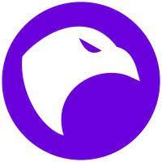

[](https://github.com/skyhawk-security/goskeleton/graphs/commit-activity)
[](.github/CODE_OF_CONDUCT.md)


[<center>](https://skyhawk.security/)
[</center>](https://skyhawk.security/)

# Go Skeleton

Go Skeleton is a project aimed at creating skeleton services for easier and quicker onboarding to both the projects and
the Golang language itself.
The projects that are generated are built with Clean Architecture and support both native (docker, ec2, etc.) and lambda
deployments.

This project adheres to the Contributor Covenant [code of conduct](CODE_OF_CONDUCT.md).
By participating, you are expected to uphold this code. Please report unacceptable behavior to [goskeleton@skyhawk.security](mailto:goskeleton@skyhawk.security) .

## Table Of Contents

- [Installation](#installation)
- [Features](#features)
- [Example](#example)
- [Discussion](#discussion)
- [License](#license)

## Installation
```zsh
go install
```

## Features
#### Clean Architecture generated code, structured and implemented
Focus on your business logic and avoid distractions

#### Have a full Golang experience
The directory structure, generated code and intensive use standard library and Golang's best practices provide a minimalistic, lean and Go-ish experience

#### Multi platform support
AWS Lambda and Native (Docker, EC2, etc) deployments are available out of the box.

#### OpenAPI 3.x code generation and validation
Write your OpenAPI spec and let us do the REST. Avoid writing boilerplate code but still have control over what's going on


## Example
#### For a web server Lambda
goskeleton web-service --serviceName mycoolservice --destination /Users/reshef.sharvit/Desktop

#### For an event driven Lambda
goskeleton event-driven --event-source SQS --event-source-arn arn:aws:sqs:us-east-1:123456789:resheftest-kabadi --serviceName mycoolservice --destination /Users/reshef.sharvit/Desktop/


## Discussion
Discuss **goskeleton** on [GitHub Discussions](https://github.com/skyhawk-security/goskeleton/discussions)


## License
[GPL-3.0](https://github.com/skyhawk-security/goskeleton/blob/main/LICENSE.md)
