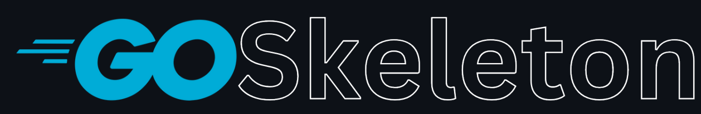

[](#)

[](https://skyhawk.security)
[](https://github.com/skyhawk-security/goskeleton/graphs/commit-activity)
[](CODE_OF_CONDUCT.md)

[](https://goreportcard.com/report/github.com/skyhawk-security/goskeleton)

# GoSkeleton
- [Installation](#installation)
- [Key Features](#key-features)
- [Usage Examples](#usage-examples)
- [Discussion](#discussion)
- [Contributing](#contributing-to-the-project)
- [License](#license)

GoSkeleton is a project aimed at creating skeleton services for easier and quicker onboarding to both the projects and
the Golang language itself.
The projects that are generated are built with Clean Architecture and support both native (docker, ec2, etc.) and lambda
deployments.

This project adheres to the Contributor Covenant [code of conduct](CODE_OF_CONDUCT.md).
By participating, you are expected to uphold this code. Please report unacceptable behavior to [goskeleton@skyhawk.security](mailto:goskeleton@skyhawk.security).

## Installation
```zsh
# clone && cd into the repository
go install
```

## Key Features
- **Clean Architecture generated code, structured and implemented**: Focus on your business logic and avoid distractions.

- **Have a full Golang experience**: The directory structure, generated code and intensive use standard library and Golang's best practices provide a minimalistic, lean and Go-ish experience.

- **Multi-platform support**: AWS Lambda and Native (Docker, EC2, etc) deployments are available out of the box.

- **OpenAPI 3.x code generation and validation**: Write your OpenAPI spec and let us do the REST. Avoid writing boilerplate code but still have control over what's going on.

## Usage Examples
#### For a web server Lambda
```zsh
goskeleton web-service --serviceName mycoolwebservice --destination $HOME/Desktop
```

#### For an event driven Lambda
```zsh
goskeleton event-driven --event-source SQS --event-source-arn arn:aws:sqs:us-east-1:123456789012:example-sqs-queue-name --serviceName mycooledsservice --destination $HOME/Desktop
```

## Discussion
Have a question? Post it in **goskeleton** [GitHub Discussions](https://github.com/skyhawk-security/goskeleton/discussions)

## Contributing to the project
Want to contribute? Please read the [Contribution Guide](CONTRIBUTING.md)

## License
[GPL-3.0](https://github.com/skyhawk-security/goskeleton/blob/main/LICENSE.md)
